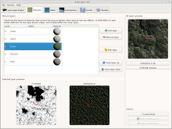

# Paysages 3D

## About

[Paysages 3D](http://www.paysages3d.com) is a work-in-progress landscape generator, modeler and renderer software.

It is written in C++ 11, using Qt 5.2 as only dependency (and Google Test for unit testing).

  

## Build/Run

### Using QtSDK (All platforms)

Download and install the latest [QtSDK](http://qt-project.org/downloads).

Launch QtCreator, and open the project file *src/paysages.pro*.

Go to the "Projects" tab to edit the directory in which the executable will be run, and set **the top project directory** (the one that contains *src* and *data*). If you don't do this, some data files will not be found.

### Using a packaged Qt (Linux)

You need at least the 5.2 packaged version of Qt, with qMake and QtCore, QtGui and QtOpengl modules.

On Ubuntu/Mint:

    sudo apt-get install qt5-qmake libqt5core5a libqt5gui5 libqt5widgets5 libqt5opengl5-dev

Then to build and run the software:

    make run

### Unit tests

Running the unit tests needs the Google Test framework:

    git submodule init
    git submodule update

Then build and run the tests:

    make tests

If you're using QtCreator, you can run the "tests" executable, not forgetting to change the directory in which the executable is run.

## Licensing

The source code is subject to the terms of the [Mozilla Public License, v. 2.0](http://mozilla.org/MPL/2.0/). Read the full terms in the LICENSE file.

## Credits

* [Michaël Lemaire](http://thunderk.net) - Main developer
* [Eric Bruneton and Fabrice Neyet](http://www-evasion.imag.fr/Membres/Eric.Bruneton/) - Publication and source code from *Precomputed Atmospheric Scattering (2008)*
* [Qt](http://qt-project.org/) - Library in use
* [GoogleTest](https://code.google.com/p/googletest/) - Used for unit testing
